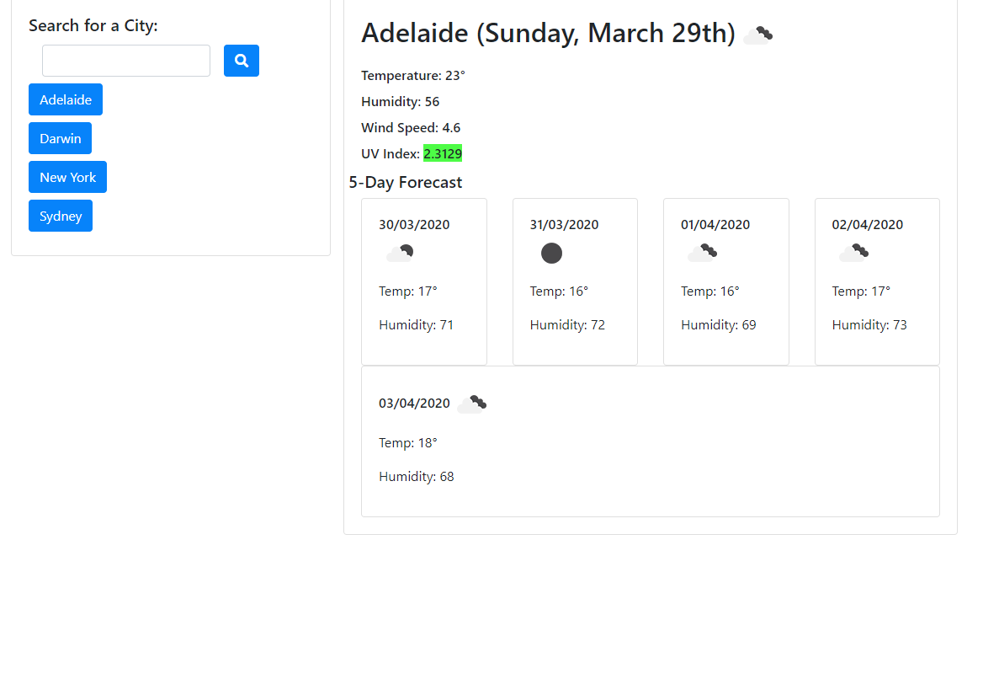
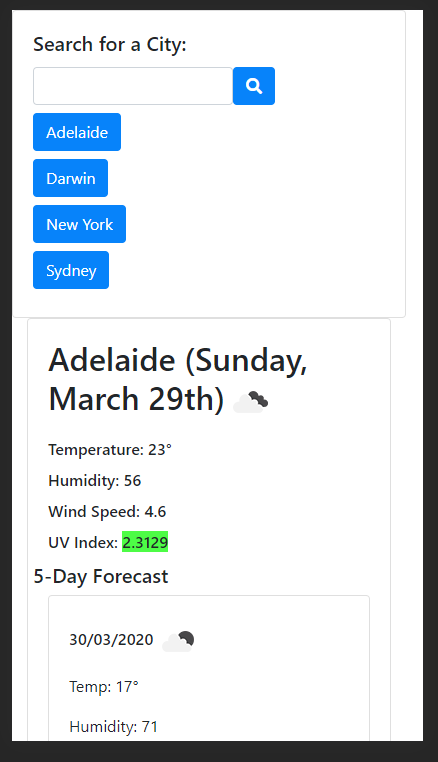

# Weather Dashboard

## Description
This is a weather dashboard that allows the user to search for a city's weather data. It provides the current data as well as a five day forecast.

## Link to Deployed Application
[View here](https://trojanface.github.io/weatherdashboard/)

### Desktop Screenshot

### Mobile Screenshot

## Credits
HTML & CSS by Matthew Teague
JQuery Library is the property of their creators/distributors and I claim no credit in their creation or distribution.
Moment Library is the property of their creators/distributors and I claim no credit in their creation or distribution.
Font Awesome is the property of their creators/distributors and I claim no credit in their creation or distribution.
Open Weather API is the property of their creators/distributors and I claim no credit in their creation or distribution.
Open UV API is the property of their creators/distributors and I claim no credit in their creation or distribution.
Images are the property of their creators/distributors and I claim no credit in their creation or distribution.
All images used are available under the Creative Commons License.
